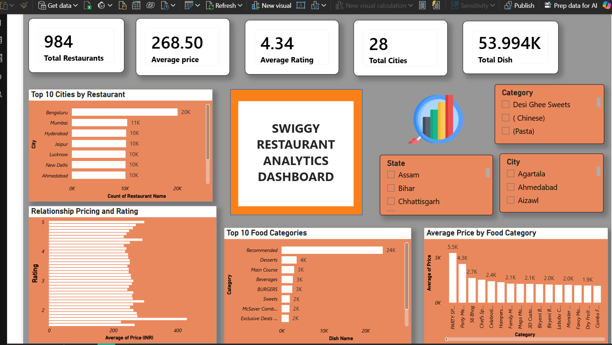

# 📊 Swiggy Restaurant Analytics Dashboard

## 📌 Project Overview

This project presents an interactive Power BI dashboard built using Swiggy restaurant data. The dashboard provides insights into restaurant distribution, food categories, pricing trends, and customer ratings across multiple cities and states.

The objective of this project is to transform raw restaurant data into meaningful visual insights that support better understanding and decision-making.

---

## 🎯 Objectives

- Analyze restaurant distribution across different cities.
- Identify the most popular food categories.
- Examine pricing trends across food categories.
- Explore the relationship between restaurant ratings and pricing.
- Create an interactive dashboard using Power BI.

---

## 🛠️ Tools & Technologies

- Power BI
- Power Query
- Microsoft Excel
- Data Visualization

---

## 🧹 Data Cleaning & Transformation

Data preprocessing was performed using Power Query in Power BI.

### Cleaning Steps:

- Removed duplicate records
- Handled missing values
- Corrected data types
- Renamed columns for better readability
- Filtered unnecessary records
- Prepared data for dashboard creation

---

## 📈 Dashboard KPIs

| KPI | Value |
|------|--------|
| Total Restaurants | 984 |
| Average Price | 268.50 |
| Average Rating | 4.34 |
| Total Cities | 28 |
| Total Dishes | 53.99K |

---

## 📊 Visualizations Included

### 1. Top 10 Cities by Restaurant Count
Displays cities with the highest number of restaurants.

### 2. Relationship Between Price and Rating
Shows how restaurant pricing relates to customer ratings.

### 3. Top 10 Food Categories
Highlights the most popular food categories.

### 4. Average Price by Food Category
Compares pricing across different food categories.

### 5. Interactive Filters
Users can filter data by:
- City
- State
- Category

---

## 🔍 Key Insights

- Bangalore has the highest concentration of restaurants.
- Recommended dishes are the most common category.
- Average restaurant ratings remain above 4.0.
- Food pricing varies significantly across categories.
- Major metropolitan cities dominate restaurant availability.

---

## 🖼️ Dashboard Preview



---

## 📂 Project Structure

```text
Swiggy-Restaurant-Analytics-Dashboard/
│
├── Dataset/
│   └── swiggy_restaurant_dataset.csv
│
├── Dashboard/
│   └── Swiggy_Restaurant_Analytics.pbix
│
├── Images/
│   └── dashboard.png
│
└── README.md# 📊 Swiggy Restaurant Analytics Dashboard

## 📌 Project Overview

This project presents an interactive Power BI dashboard built using Swiggy restaurant data. The dashboard provides insights into restaurant distribution, food categories, pricing trends, and customer ratings across multiple cities and states.

The objective of this project is to transform raw restaurant data into meaningful visual insights that support better understanding and decision-making.

---

## 🎯 Objectives

- Analyze restaurant distribution across different cities.
- Identify the most popular food categories.
- Examine pricing trends across food categories.
- Explore the relationship between restaurant ratings and pricing.
- Create an interactive dashboard using Power BI.

---

## 🛠️ Tools & Technologies

- Power BI
- Power Query
- Microsoft Excel
- Data Visualization

---

## 🧹 Data Cleaning & Transformation

Data preprocessing was performed using Power Query in Power BI.

### Cleaning Steps:

- Removed duplicate records
- Handled missing values
- Corrected data types
- Renamed columns for better readability
- Filtered unnecessary records
- Prepared data for dashboard creation

---

## 📈 Dashboard KPIs

| KPI | Value |
|------|--------|
| Total Restaurants | 984 |
| Average Price | 268.50 |
| Average Rating | 4.34 |
| Total Cities | 28 |
| Total Dishes | 53.99K |

---

## 📊 Visualizations Included

### 1. Top 10 Cities by Restaurant Count
Displays cities with the highest number of restaurants.

### 2. Relationship Between Price and Rating
Shows how restaurant pricing relates to customer ratings.

### 3. Top 10 Food Categories
Highlights the most popular food categories.

### 4. Average Price by Food Category
Compares pricing across different food categories.

### 5. Interactive Filters
Users can filter data by:
- City
- State
- Category

---

## 🔍 Key Insights

- Bangalore has the highest concentration of restaurants.
- Recommended dishes are the most common category.
- Average restaurant ratings remain above 4.0.
- Food pricing varies significantly across categories.
- Major metropolitan cities dominate restaurant availability.

---

## 🖼️ Dashboard Preview


---
